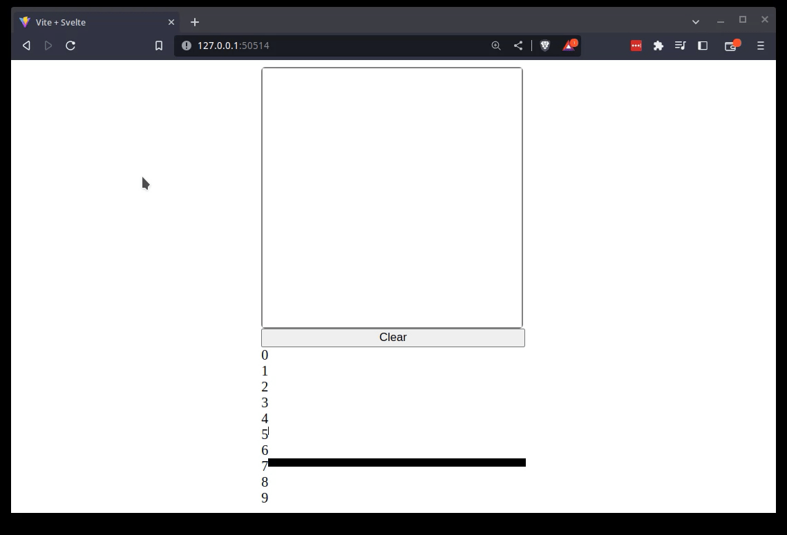

# Digit Recognition
A small web app to draw digits in a web browser interface and make predictions on what the digit is.



### Built with

[](https://skillicons.dev)

## Running the app
- Clone the repo

```
git clone github.com/hsrada23/mnist
```
- Build a docker image using the Dockerfile
```
docker build -t mnist .
```
- Run the image
```
docker run -p 50514:8000 -p 9999:9999 --name digit-recognition mnist:latest
```
- In a web browser open the url
```
http://127.0.0.1:50514/
```
- Draw any digit and watch the diffrent bars showing the probability of different digits.
